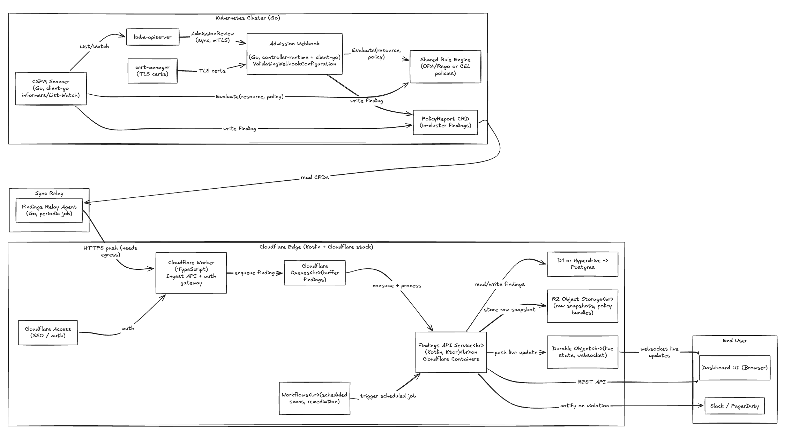

# Kubeguard

## System Design

## The problem 

Kubernetes security tooling today is split:
- CSPM scanners find misconfigurations *after* they're already deployed (detect), 

- And admission controllers block bad configs *before* they land (prevent) 

But they're built as two separate systems with two separate rule sets. 

That gap lets the same misconfiguration slip through prevention (rule not in the webhook yet) and then sit undetected until the next scan, or get flagged by the scanner but never actually blocked next time.

## What this project solves:

 one shared rule engine that both the CSPM Scanner and the Admission Webhook evaluate against, so:

- a policy written once applies both retroactively (scan existing resources) and going forward (block new ones) — no drift between "what we detect" and "what we prevent"
- findings from both paths land in one place (PolicyReport CRD → relayed to a central findings API/dashboard), giving one consistent view of cluster risk instead of two disconnected tools

